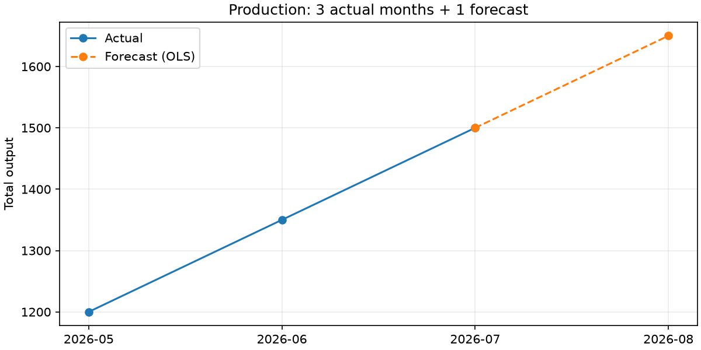

# 노웨어 — Agent SkillLoop

한 Agent의 해결 경험을 다음 Agent의 Skill로.

코딩 경험이 적은 사내 엔지니어가 업무를 요청하면, Agent가 환경 제약으로 막힌 지점에서 검증된 팀 Skill을 재사용합니다. 처음 겪는 문제는 해결 절차를 후보로 남기고 사람 검토·독립 Replay를 거쳐 공유합니다.

## 문제와 해결

사내 패키지 공급 경로와 문서 접근 제약 때문에 같은 실패·탐색이 개인 대화에서 반복됩니다. SkillLoop는 검색 결과 전달에 그치지 않고 실제 적용·검증·재사용 기록을 연결합니다. Skill의 불변 내용/digest와 usage를 분리하고, 검토한 exact candidate와 Replay 대상이 같을 때만 게시합니다.

## 현재 동작과 확인 범위

- **P0 기존 경험 재사용:** 자연어 설치 요청 → 실제 pip 공급 실패 → MATCH → 같은 작업 venv에 설치·버전/import 확인 → 실제 reuse +1. 다른 경로에서 Claude 3개 사례 성공. 추가로 다른 패키지 2종에 같은 환경 Skill을 적용하는 코드 검증을 진행했습니다.
- **P1 새 경험:** NASCA(가상) 사내환경에서 직접 XLSX 읽기 실패 → NO_MATCH → 새 Claude의 실제 탐색 → 열린 Excel read-only 접근 → 현재 파일의 열 해석 → OLS 예측·PNG 차트 → 환경 절차만 후보화까지 실행했습니다.
- **상태줄/대시보드:** 로컬 실행과 관찰된 팀 게시·재사용 실적을 구분합니다. 같은 이벤트를 중복 집계하지 않으며, 동기화 미연결은 확인 대기로 표시합니다.
- **P1 실제 공유·재사용:** exact 후보 사람 승인 → 다른 문서 독립 Replay PASS → GitHub team-skill-store 게시 → 새 Claude Warm에서 업무·차트·reuse+1·후보0 → 재사용 이벤트 공유·중복 없는 수신까지 실행했습니다. 추가 Cold 3회도 다른 시트/열/값에서 성공했습니다.
- **남은 검증/정리:** 별도 B PC 재현과 최종 시연·갤러리 검토. 현재 원격 검증은 같은 PC의 독립 workspace와 실제 GitHub에서 수행했습니다.



실제 실행 로그: [P0 3회 재현](result/p0-reproduction/README.md), [P1 시나리오 정정·Cold 결과](result/scenario-correction/README.md), [추가 Cold 3회·실제 원격 Warm·왕복 검증](result/p1-acceptance/README.md).

## 설치 및 P0 실행 (Windows PowerShell)

```powershell
git clone https://github.com/THEGREATCJPark/ddthon.git
cd ddthon
python -m venv .venv
.\.venv\Scripts\python.exe -m pip install -e ".[p1]" -r requirements-dev.txt
.\.venv\Scripts\python.exe -m skillloop run-p0
.\.venv\Scripts\python.exe -m pytest --hypothesis-seed=20260908
```

`run-p0`는 명시적인 자체 데모입니다. 실제 업무 요청을 이것으로 대체하지 않습니다. 자연어 P0는 새 작업 폴더를 준비하고 그 폴더에서 Claude Code를 시작합니다.

```powershell
.\scripts\prepare-p0.ps1 -Destination "$env:USERPROFILE\Desktop\skillloop-work-new" -Python .\.venv\Scripts\python.exe
cd "$env:USERPROFILE\Desktop\skillloop-work-new"
claude
```

요청: **이 프로젝트 requirements.txt의 패키지를 설치해줘.**

기본 준비 예제는 skillloop-demo-pkg 1.0.0입니다. 최소 일반화 경로는 `apply-requirements --policy <운영자-승인-설정>`을 사용합니다. 하나의 pinned 패키지·명시적 로컬 공급원·import 매핑을 지원하며, 임의 pip 옵션/URL/복수 패키지를 복구하는 범용 엔진은 아닙니다. Agent가 자신의 실행 승인 설정을 만들면 안 됩니다.

## P1 실행 준비

Windows Desktop Excel 설치·실행 및 pywin32가 필요합니다. Excel이 없는 환경의 P1 실접근은 NOT_RUN입니다. 일반 설치·단위 테스트에는 실제 회사 데이터나 토큰이 필요하지 않습니다. Claude 업무 테스트는 사용자가 설정한 Claude Code/Bedrock 인증을 사용합니다.

```powershell
.\.venv\Scripts\python.exe scripts/prepare-p1.py "$env:USERPROFILE\Desktop\skillloop-p1-new"
```

준비 터미널을 유지하고 다른 터미널에서 생성된 `cold` 폴더로 이동해 Claude를 시작합니다. 요청: **AAAAA01_직전_3달_생산량.xlsx를 읽고 다음달 예상 생산량을 포함한 추세선을 보여줘.** 환경 설명은 NASCA(가상)이며 실제 NASCA 제품 검증을 뜻하지 않습니다. 암호나 해결 방법은 Agent 작업 파일에 제공하지 않습니다. 작업 종료 시 준비 폴더에 `STOP` 파일을 만들면 준비한 workbook만 닫습니다.

사람 검토는 `skillloop review`, 새 접근 검증은 `replay`, 공유는 `publish` 명령으로 분리합니다. 각 명령의 `--help`에서 필수 인자를 확인합니다. 후보 생성은 승인·게시가 아니며, Agent가 review의 사람 확인을 대신 입력하지 않습니다. GitHub sync에는 별도 네트워크·write 인증이 필요합니다. `team-skill-store`는 공유 descriptor·비민감 reuse 이벤트만 전송하고 로컬 DB·업무 값·암호는 보내지 않습니다.

## 팀 공유 시연

[B PC GitHub 준비·Warm 시연 가이드](aidlc-docs/construction/build-and-test/b-github-demo-guide.md), [팀원 전달용 진행 요약](aidlc-docs/construction/build-and-test/team-update.txt). 제품 main과 공용 데이터 team-skill-store를 별도 작업 경로로 운영합니다. 이번 구현은 Git 공유 어댑터입니다. S3·사내 저장소 연결은 향후 별도 인증/권한/동기화 설계와 어댑터로 확장할 수 있으며, 현재 구현 완료로 주장하지 않습니다.

## 검증 범위와 공유 신뢰

P1에서 공유·실행 가능한 절차는 현재 지원된 `file-access / excel-com-attach` 어댑터 범위입니다. Agent가 현재 환경을 탐색하고 문서별 시트·열을 해석하며, 예측·차트 계산은 제품이 수행합니다. 임의의 새 코드를 그대로 학습·실행하는 범용 엔진은 아닙니다.

Git 수신은 번들 hash/digest와 실제 수신 commit을 확인하지만 원격 작성자의 사람 검토·Replay를 독립 서명으로 증명하지는 않습니다. 신뢰하는 팀 저장소/작성자가 승인된 게시 경로를 사용하는 운영 전제이며, 원격 exact Skill의 명시적 실행 확인을 유지합니다. Git에 있다는 이유만으로 모든 내용이 안전하다고 주장하지 않습니다.

## 사용한 AI 도구와 개발 기록

Claude Code/Amazon Bedrock으로 요구사항·설계·Unit 구현 및 실제 업무 실행을 진행했고, Codex/Astra가 기존 승인 산출물을 인계받아 통합·결함 수정·검증을 진행했습니다. 공식 AI-DLC 규칙과 기존 audit 이력을 보존합니다. [현재 상태](aidlc-docs/aidlc-state.md), [audit](aidlc-docs/audit.md), [최종 표현 정합화 계획](aidlc-docs/construction/plans/final-presentation-alignment-plan.md).

## 팀

| 이름 | 담당 |
| --- | --- |
| 박찬준(CJ) | 공통 계약·통합·CLI·상태줄·P1 서비스 연결 |
| 최호길(hogil) | U1 검색·P0 재사용·P1 적용 분기 |
| 한석훈(hanseokhun) | U2 Excel 환경 접근·독립 Replay |
| 윤여훈 | 독립 QA·사용성·실행 증거 검토 |

## 검증과 한계

실제 Excel의 재열기 시간 초과를 기록했고 준비 방법 수정 후 실제 읽기 검사를 통과했습니다. 실패·대역·실환경 검증은 로그에서 구분합니다. Python CI는 고정 Hypothesis seed로 일반 테스트를 실행하며, 실제 Excel 검사는 명시 opt-in으로 분리합니다. 소스 checkout의 fixture를 사용하는 해커톤 실행 형태이며 wheel만으로 모든 데모 자원이 제공되는 배포 형태는 아닙니다.

제출에는 소스·의존성 선언·fixture·aidlc-docs·실행 증거를 포함합니다. .venv, .git, 개인 설정, 인증정보는 제출 ZIP에 넣지 않습니다.

## 팀 협업 공간

[노웨어 · Agent Skillloop 열기](https://thegreatcjpark.github.io/ddthon/)

직접 표시하는 진행 순서도, 팀 댓글·답글, 다른 팀의 익명 딴지를 함께 봅니다. 웹 소스·lockfile·설정·라이선스는 [team-hub/](team-hub/README.md)에 포함하며, 기존 codex/team-hub 작성 이력을 보존합니다. GitHub Actions가 실행 대상 SHA를 빌드해 Pages로 배포합니다. 댓글·캡처는 기존 Firebase 커뮤니티이며 제품 Skill 저장소와 별개입니다. 웹의 P0/P1 버튼 진행은 설명용 시뮬레이션이고 실제 실행 로그·차트를 따로 연결합니다. 순서도 표시는 제품 실행 검증이나 AI-DLC 승인을 대신하지 않습니다.
