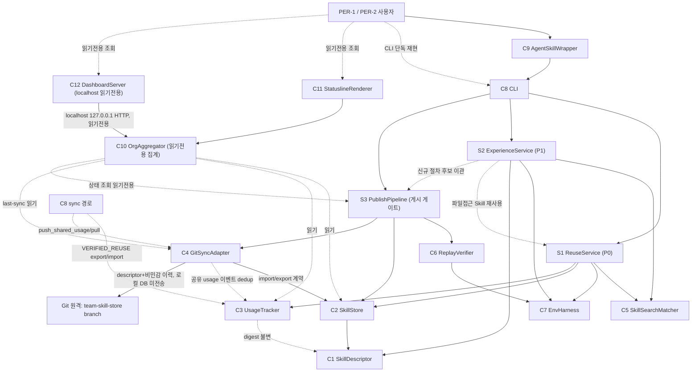

# Component Dependencies — Agent SkillLoop

**단계**: INCEPTION / Application Design — Part 2
**작성일**: 2026-09-08
**근거**: `components.md`, `services.md`, `application-design-plan.md`(AD-Q4/Q5)

> **의존성·통신 패턴·데이터 흐름**입니다. **통신은 Python 내부 호출(명시적 인터페이스)** 기본이며 네트워크 서비스·브로커는 없다(AD-Q5). **소유 컴포넌트만 자기 상태를 쓰기**하고 타 컴포넌트는 인터페이스로만 접근한다(NFR-INT-1).

---

## 1. 의존성 매트릭스 (행 → 열: "행이 열을 호출/의존")

| ↓호출 \ 피호출→ | C1 Desc | C2 Store | C3 Usage | C4 Sync | C5 Match | C6 Replay | C7 Env | S1 | S2 | S3 |
|---|---|---|---|---|---|---|---|---|---|---|
| **C8 CLI** | | | | | | | | ✅ | ✅ | ✅ |
| **C9 Wrapper** | (→C8 CLI만) | | | | | | | | | |
| **S1 Reuse** | ✅ | ✅ | ✅ | | ✅ | | ✅ | | | |
| **S2 Experience** | ✅ | | | | ✅ | | ✅ | (↔S1) | | |
| **S3 Publish** | ✅ | ✅ | | ✅(push_descriptors) | | ✅ | | | | |
| **C2 Store** | ✅ | | | | | | | | | |
| **C4 Sync** | | ✅(계약) | ✅(공유 usage 계약) | | | | | | | |
| **C6 Replay** | ✅ | | | | | | ✅ | | | |
| **C10 OrgAgg**(읽기전용) | | ✅(읽기) | ✅(읽기) | ✅(last-sync) | | | | | | ✅(상태 조회, 읽기전용) |
| **C8 sync 경로** | | | ✅(export/import) | ✅(push_shared_usage/pull) | | | | | | |

**핵심 규칙**
- **C4 GitSyncAdapter → C2 SkillStore**: sync는 store의 **import/export 계약 위에서만** 동작. 저장 파일 직접 수정·무결성/CONFLICT 재구현·게시 lifecycle 구현 **금지**(AD-Q4). 대상=`team-skill-store` branch, 로컬 DB 미전송(FR-SYNC-5).
- **C4 GitSyncAdapter → C3 UsageTracker(공유 usage 계약)**: 재사용 이벤트의 전송(`push_shared_usage`/`pull`)만 담당. 이벤트 **검증·dedup은 C3**(FR-USAGE-4). C4는 dedup을 재구현하지 않는다.
- **S3 PublishPipeline**만 게시 상태 전이를 소유. C8 CLI·C4 Sync는 **게이트를 우회하지 않는다**(AD-Q3). **S3는 읽기전용 상태 조회 계약(`list_lifecycle_states`/`query_lifecycle_state`)을 제공**하며 **C10이 이를 통해서만 상태를 읽는다**(추정·게이트 재구현 금지).
- **C3 UsageTracker**만 usage 카운트/공유 이벤트를 쓰기·검증·dedup(FR-USAGE-4). content digest(C1/C2)와 분리(AD-Q2). **재사용 이벤트 공유 자격(VERIFIED_REUSE)은 Skill 게시 게이트(SHAREABLE)와 별개** — import 한 Skill을 실제 재사용만 한 환경도 재후보화·재승인·재Replay 없이 실적 이벤트를 공유(A게시→B import→B 검증 성공→B 공유→A 1회 반영).
- **재사용 이벤트 공유 경로는 S3.publish 와 독립**(S3→C3 커플링 없음): 새 Skill 게시 없이도 `sync`가 C3(export/import)·C4(push_shared_usage/pull)로 이벤트를 왕복시킨다. S3.publish 는 descriptor(`push_descriptors`)만 다룬다.
- 순환 의존 없음(계층: Surface → Service → Capability/Persistence → Domain).

**범위 변경(집계·표현 — 읽기전용 파생)**
- **C10 OrgAggregator**는 C2·C3·C4.last_sync를 **읽기만** 하고 **후보/검토/Replay/게시 상태는 S3 읽기전용 조회 계약으로만** 읽는다(소유 상태 미수정). 원격 게시본은 `remote_publish_evidence`와 `local_review_evidence`를 분리 표시하고 수신 환경 승인·Replay 기록을 만들지 않는다(AD-Q4). **C11 StatuslineRenderer / C12 DashboardServer**는 C10 스냅샷을 소비하는 **읽기전용 표면**(쓰기·승인·게시 없음, NFR-SEC-2).
- **공유 usage**: C4 pull/push_shared_usage ↔ C3 export/import_shared_usage(VERIFIED_REUSE, 이벤트 검증·dedup). C4는 전송, 검증·dedup은 C3, 집계는 C10.

**"네트워크 서비스 없음"(AD-Q5)의 적용 범위(명확화)**: 이 원칙은 **내부 컴포넌트 간 통신**을 뜻한다 — 컴포넌트끼리는 Python 내부 호출로만 결합하고 메시지 브로커·상시 서버·중앙 API를 두지 않는다(ttt의 `/api/organization` 중앙 API 미채택). **C12 DashboardServer가 localhost(127.0.0.1)에서 읽기전용 HTTP로 화면을 제공하는 것은 예외적 표현 표면**이며, 이는 내부 컴포넌트 통신 수단이 아니라 사람이 보는 로컬 시연 화면이다. 외부 노출·인증·멀티유저·호스팅 범위 아님(NFR-SEC-2).

---

## 2. 통신·데이터 흐름 다이어그램



### Text Alternative (always included)
```
표면 계층:
- 사용자 → C9 Wrapper → C8 CLI  (또한 사용자는 CLI 단독 재현 가능)
- C8 CLI → S1 / S2 / S3 서비스 호출

Skill 재사용 (S1 ReuseService, 시나리오 비의존):
- S1.apply_and_verify 는 매칭된 Skill 의 applicability(문제 유형)로 적용·검증 방식 결정
- pip-install 유형 → 설치+효과검증 / file-access 유형 → 허용 절차+접근효과검증
- S1.verify() = Skill 직접 효과 검증. 실제 성공만 C3 카운트(+1)
- Excel/파일접근 Skill 을 찾아도 pip 흐름으로 들어가지 않음

P1 업무 (S2 ExperienceService):
- S2 → C7.attempt_direct_parse (실제 parser 실행 관찰 → 실패 관찰; 강제 raise 아님)
- S2 → C5 검색(NO_MATCH 판정)
- 적용 가능한(파일접근 유형) 기존 Skill 있으면 → S1.apply_and_verify 재사용
- NO_MATCH 면 실제 업무 Agent 가 환경 관찰·허용 대안 선택·코드작성·실행(C7은 사실만 제공)
- S2.verify_work_result() = 요청 P1 업무 결과 검증(FR-P1-5). 재사용해도 업무 완료·검증까지
- 새 절차 발견 시에만 C1 후보 생성(재사용·중복 절차는 후보 안 만듦) → S3 이관

P1 게시 (S3 PublishPipeline) — 로컬 확정 ≠ 원격 게시 완료:
- S3 → C6 독립 Replay, C2 로컬 저장(LOCALLY_APPROVED), C4.push_descriptors 원격 push(대상=team-skill-store branch)
- push 성공 시에만 PUBLISHED, 실패 시 PUBLISH_PENDING(로컬 보존+재시도 근거). 최초 게시·재시도 모두 가능
- C4 → C2 : import/export 계약 위에서만 (파일 직접수정/게이트 우회 금지)
- descriptor export 는 게이트 충족 공유 대상(SHAREABLE=승인+Replay PASS+digest 동일성)만 — PUBLISHED 전제 아님(순환 없음), import 는 원격 문자열로 로컬 승인/Replay 생성 안 함
- C4 → Git 원격 team-skill-store branch : descriptor + 비민감 재사용 이벤트만, 로컬 DB 파일 미전송(FR-SYNC-5)
- S3 는 읽기전용 상태 조회 계약(list_lifecycle_states/query_lifecycle_state) 제공 → C10 이 상태를 이 계약으로만 읽음(추정/게이트 재구현 금지)
- C2 → C1 (무결성/digest), C3 → C1 (usage 변경은 digest 불변)

재사용 이벤트 공유 (게시와 독립된 sync 경로):
- 자격 = VERIFIED_REUSE(정확한 Skill 참조 + 실제 성공 근거 + 비-DEMO) ≠ SHAREABLE(게시 게이트)
- C8 sync → C3.export_shared_usage(VERIFIED_REUSE) → C4.push_shared_usage ; pull → C3.import_shared_usage(검증·event_id dedup)
- 흐름: A게시 → B import → B 실제 적용·검증 성공 → B 이벤트 공유 → A pull·import → 조직 실적 1회 반영
- import 한 Skill 을 재사용만 한 환경도 재후보화·재승인·재Replay 없이 이벤트 공유(신규 Skill 게시 게이트는 유지)

조직 집계·표현 (범위 변경 — 읽기전용 파생):
- C10 OrgAggregator: C2(공유 게시)·C3(실제 재사용, import 포함)·C4.last_sync 를 읽고, 상태(후보/검토/Replay/게시)는 S3 읽기전용 조회로만 → 단일 스냅샷(FR-ORG-1~5)
- 원격 게시본은 remote_publish_evidence 와 local_review_evidence 분리 표시, 수신 환경 승인/Replay 기록 미생성(AD-Q4)
- C11 상태줄 / C12 로컬 대시보드(localhost 127.0.0.1 HTTP, 읽기전용): 동일 스냅샷 소비(쓰기/승인/게시 없음, NFR-SEC-2)
- 실제 실적 vs DEMO_SEED 구분 유지(FR-USAGE-3)

"네트워크 서비스 없음"은 내부 컴포넌트 통신에 적용(브로커/상시서버/중앙 API 없음). C12 의 localhost 읽기전용 화면은 사람이 보는 로컬 시연 표면(예외)이며 내부 통신 수단이 아님.

규칙: 소유 컴포넌트만 자기 상태 쓰기(usage 검증·dedup=C3, 저장=C2, 전송/last-sync=C4). 게시 상태 전이·상태 조회 계약은 S3만 소유. C10~C12는 읽기전용 파생(무쓰기). 순환 의존 없음.
```

---

## 3. 동시 수정 위험 회피 (NFR-INT-1) — 계약 우선 고정 지점

병렬 개발 시 **먼저 고정해야 하는 계약**(변경 시 조율 대상):
1. **SkillDescriptor 직렬화 포맷 + digest 규칙**(C1) — 다수 컴포넌트가 참조.
2. **SkillStore import/export 계약 + CONFLICT 판정**(C2) — C4가 이 위에서 동작.
3. **UsageTracker 카운트 인터페이스 + ReuseEvidence 규격**(C3).
4. **SearchOutcome/Applicability 반환 규격**(C5) — S1/S2 공용.
5. **ReplayResult + 게시 게이트 입력 규격**(C6→S3).
6. **공유 재사용 이벤트 레코드 규격 + VERIFIED_REUSE 자격 + 이벤트 id 검증·dedup 규칙**(C3) — C4 전송·C10 집계 공용(FR-USAGE-4). **게시 게이트(SHAREABLE)와 분리된 자격**임을 계약에 명시. ★ 범위 변경.
7. **S3 읽기전용 상태 조회 계약**(`list_lifecycle_states`/`query_lifecycle_state` + `remote_publish_evidence`/`local_review_evidence` 규격) — C10 이 상태를 추정·재구현하지 않고 조회하는 유일 경로. ★ 범위 변경.
8. **조직 스냅샷(OrgSnapshot) 규격 + last-sync 메타**(C10) — C11 상태줄·C12 대시보드가 동일하게 소비(FR-UI-3, FR-ORG-5). ★ 범위 변경. **이 공통 조회 계약(6·7·8)이 확정되면 표현 표면 작업을 코어와 병렬** 진행 가능(실제 데이터 연결·시연 검증은 후행).

> 이 계약들을 **정렬 구간에서 먼저 확정**하면 이후 컴포넌트를 소유 경계로 나눠 **공유 mutable state 동시 수정 없이 병렬** 가능. **실제 Unit 경계·사람 배정은 Units Generation**에서 이 계약을 근거로 결정(seam 6개에 고정하지 않음).

> **채택됨 vs 미결정(명확화)**: 공유 저장소 `THEGREATCJPark/ddthon` + `team-skill-store` branch 사용은 **채택**(SCOPE-CHANGE-1). 반면 **로컬 Git 작업 경로·remote 등록·인증·branch 세부 운용 방식은 미결정**이며 설계 승인 + Units 담당 확정 후 "초기 구현 준비"에서 정한다. UI 프레임워크·표시 방식도 미결정(해당 Unit의 NFR Requirements(minimal)에서 선택 → Code Generation에서 구현).
