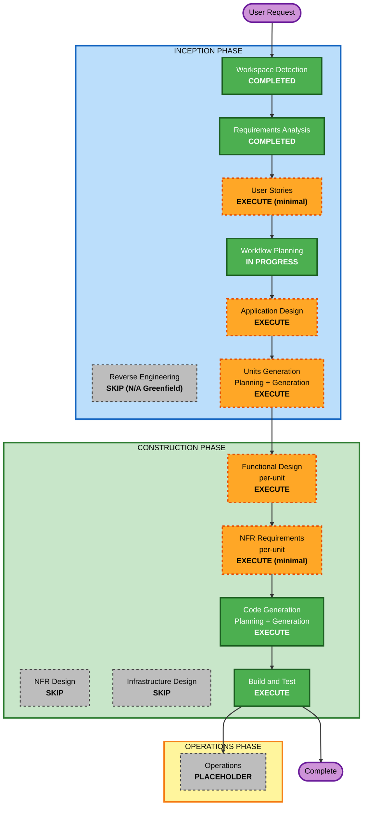

# Execution Plan — Agent SkillLoop (MVP)

**단계**: INCEPTION / Workflow Planning
**Project Type**: Greenfield
**작성일**: 2026-09-08
**근거**: 승인된 `requirements.md` (FR/NFR/CON/RISK), `requirement-verification-questions.md`(Q1–Q14), `requirement-clarification-questions.md`(CQ-1)

> 이 계획은 **어떤 단계를 실행/생략하는지와 순서·의존성·병렬화 구간**을 정한다. **상세 Unit 개수·이름·사람별 역할·아키텍처·schema/API는 Application Design / Units Generation에서 결정**한다.

---

## 1. Detailed Analysis Summary

### 1.1 Transformation Scope (Brownfield Only)
- **N/A** — Greenfield. Reverse Engineering 없음.

### 1.2 Change Impact Assessment
- **User-facing changes**: Yes — Claude Code 자연어 요청 → 얇은 Agent Skill → CLI. 데모/사용성 평가 대상(FR-SURF-*).
- **Structural changes**: Yes — 신규 다중 컴포넌트(Skill descriptor/store · Git sync · search/match · apply+verify · P1 flow · usage). 컴포넌트 경계 정의 필요.
- **Data model changes**: Yes — 구조화 descriptor(불변 identity + 가변 usage), digest/dedup, conflict 규칙(FR-SKILL-*, FR-SYNC-3, NFR-RES-*).
- **API/contract changes**: Yes(내부) — CLI 명령·컴포넌트 간 계약. 단, 대외 API 아님.
- **NFR impact**: 제한적 — 보안 핵심(NFR-SEC), 복원력 핵심(NFR-RES), 테스트(PBT Partial + process/contract/regression). 범용 성능/HA/인프라 없음.

### 1.3 Component Relationships (Brownfield Only)
- **N/A** — Greenfield.

### 1.4 Risk Assessment
- **Risk Level**: **Medium** — 다중 컴포넌트 신규 개발 + 4인 병렬 + 시간 제약. 프로덕션/배포 리스크는 없음(로컬 합성 환경).
- **핵심 리스크**: RISK-1(범위/시간: P0+P1 전체 loop), RISK-2(병렬 개발 중 공유 state 충돌 — NFR-INT-1).
- **Rollback Complexity**: Easy(로컬·합성·Git 이력).
- **Testing Complexity**: Moderate(P0/P1 종단 흐름 실제 효과 검증 + PBT 대상 순수 로직).

---

## 2. Workflow Visualization



### Text Alternative (always included)
```
INCEPTION
- Workspace Detection ....... COMPLETED
- Reverse Engineering ....... SKIP (N/A, Greenfield)
- Requirements Analysis ..... COMPLETED (approved)
- User Stories .............. EXECUTE (minimal depth)
- Workflow Planning ......... IN PROGRESS
- Application Design ........ EXECUTE
- Units Generation ......... EXECUTE

CONSTRUCTION (per-unit loop, then Build & Test)
- Functional Design ........ EXECUTE (per applicable unit)
- NFR Requirements ......... EXECUTE (minimal; PBT-09 framework 선정)
- NFR Design ............... SKIP
- Infrastructure Design .... SKIP
- Code Generation .......... EXECUTE (ALWAYS)
- Build and Test ........... EXECUTE (ALWAYS)

OPERATIONS
- Operations ............... PLACEHOLDER
```

---

## 3. Phases to Execute / Skip (근거 포함)

### 🔵 INCEPTION PHASE
- [x] **Workspace Detection** — COMPLETED
- [x] **Reverse Engineering** — **SKIP (N/A)**. Greenfield, 기존 코드 없음.
- [x] **Requirements Analysis** — COMPLETED (승인됨)
- [ ] **User Stories** — **EXECUTE (minimal depth)**
  - **Rationale**: 필요성 판단 결과 실행. 다중 persona(핵심: 코딩 경험 적은 사내 엔지니어 + 이해관계자: 개발자/팀·팀 리뷰어·다음 Agent), user-facing 흐름, **명시적 수용 기준이 가치 있음**(P0 재사용 성공·검증, P1 게시 게이트 FR-P1-7, 카운트 규칙 §4.6). 4인 병렬 개발의 **공유 이해** 확보. **최소 깊이**로 작성해 requirements와 중복을 피하고 FR ID를 참조(문서 팽창 방지 — 사용자 요청 반영).
- [ ] **Application Design** — **EXECUTE**
  - **Rationale**: 신규 다중 컴포넌트의 **경계·책임·컴포넌트 간 계약**을 정의해야 함. 특히 **NFR-INT-1(공유 mutable state 동시 수정 최소화)**를 만족하는 병렬 개발 구조의 토대가 여기서 만들어짐. (구체 아키텍처/클래스/schema는 이 단계 산출물에서 결정)
- [ ] **Units Generation** — **EXECUTE**
  - **Rationale**: 4인 병렬 개발을 위해 **Unit 분해 + Unit 의존성 + Unit-스토리 매핑**이 필요. 사용자가 요청한 "Unit 분해·병렬화 구간"의 **공식 결정 지점**. unit-of-work-dependency.md가 병렬화·통합 위험 회피 전략을 구동.

### 🟢 CONSTRUCTION PHASE (per-unit loop)
- [ ] **Functional Design** — **EXECUTE (per applicable unit)**
  - **Rationale**: 비즈니스 규칙/데이터 모델 설계 필요 — descriptor(불변 identity/가변 usage), digest·dedup, conflict 판정(FR-SYNC-3/NFR-RES-2), 매칭·applicability, OLS 계산(FR-P1-5), 게시 게이트(FR-P1-7), 카운트 규칙. 또한 **PBT-01(속성 식별)**이 이 단계 산출물에 포함되어야 함(PBT Partial). 단순 Unit은 최소 깊이/생략 판단은 해당 Unit 진입 시.
- [ ] **NFR Requirements** — **EXECUTE (minimal depth)**
  - **Rationale**: 범용 NFR 확대는 하지 않되(사용자 요청), **PBT-09가 tech stack 결정에 PBT framework 명시를 요구**(Python → Hypothesis) + 의존성 선언(requirements.txt) + 이미 확정된 NFR-SEC/RES/TEST를 tech 선택으로 옮기는 최소 기록이 필요. 최소 깊이로 한정.
  - **UI 프레임워크 선택(범위 변경, 단계 명확화)**: 상태줄·로컬 대시보드(C11/C12) Unit의 **UI 프레임워크·표시 방식은 이 단계(NFR Requirements minimal)에서 결정**하고, **실제 구현은 Code Generation**에서 수행한다. Application Design에서는 프레임워크를 확정하지 않는다(읽기전용·localhost·동일 스냅샷 소비 경계만 고정).
- [ ] **NFR Design** — **SKIP**
  - **Rationale**: 복원력 항목(dedup·conflict·sync 실패·재시작 보존)은 소수이며 **Functional Design에 흡수**하는 편이 적절. 별도 NFR 패턴 설계 문서는 과확장(사용자 요청: NFR/중복 문서 최소화). 성능/스케일/HA 요구 없음.
  - **SKIP-BOUNDARY-1 (승인된 경계, 범위 변경 확장)**: NFR Design을 생략해도 **승인된 핵심 보안(NFR-SEC-1~4)·무결성(digest, FR-SKILL-4)·복원력(NFR-RES-1~4) 요구는 해당 Unit의 Functional Design과 테스트(PBT/process/contract/regression)에 반드시 반영**한다. **UI·동기화 Unit에도 확장 적용**: 읽기전용 경계(NFR-SEC-2)·secret/원본 비표시(NFR-SEC-1)·동일 집계와 실적/DEMO_SEED 구분(FR-UI-3)·**공유 usage dedup·중복 집계 방지(FR-USAGE-4, FR-ORG-3)**·read-model 읽기전용(NFR-INT-1)을 설계·테스트에 반영. 생략은 "별도 NFR 패턴 문서"의 생략일 뿐, 요구 자체의 면제가 아니다.
- [ ] **Infrastructure Design** — **SKIP**
  - **Rationale**: 클라우드/배포 인프라 없음. 로컬 Windows Python + 로컬 Git + 로컬 mock index로 완결. 배포 아키텍처·클라우드 리소스 매핑 불필요(CON, 범위 외). 범위 변경(UI+Git)까지 포함해 재확인: 로컬 읽기전용 대시보드는 localhost 표시이고, Git 공유는 **동일 저장소 branch 사용(신규 인프라 없음)**이므로 SKIP 유지.
  - **SKIP-BOUNDARY-2 (승인된 경계, 범위 변경 갱신)**: Infrastructure Design 생략은 **별도 인프라 설계 단계의 생략**을 의미하며, **채택된 Git 원격 동기화 요구(FR-SYNC-1, Q3=A + 범위 변경으로 `team-skill-store` branch 채택)를 로컬 Git만으로 축소하는 뜻이 아니다.** 원격 clone/pull/push·무결성·CONFLICT·실패 시 로컬 보존 요구는 유지된다. **실제 branch·Git 작업 경로 설정과 세부 운용 방식은 미결정**이며, 설계 승인 + Units 담당 확정 후 **초기 구현 준비**에 배치한다.
- [ ] **Code Generation** — **EXECUTE (ALWAYS)** — 구현 계획 + 코드/테스트 생성.
- [ ] **Build and Test** — **EXECUTE (ALWAYS)** — 전 Unit 빌드 + 단위/통합/계약/회귀 + PBT(seed 로깅) 실행, 실제 효과 검증, 증거 기록(PASS/FAIL/NOT_RUN).

### 🟡 OPERATIONS PHASE
- [ ] **Operations** — **PLACEHOLDER** — 향후 배포/모니터링. 본 MVP 범위 아님.

---

## 4. 단계 순서 · 의존성 · 병렬화 구간 (제안)

> 상세 Unit/역할/아키텍처는 결정하지 않음. 아래는 **순서·의존성·병렬화 후보 구간**의 제안이며 Units Generation에서 확정.

### 4.1 순서 & 의존성
```
[정렬·수렴 구간 — 팀 공동, 순차]
User Stories(minimal) -> Application Design -> Units Generation
   목적: 컴포넌트 경계·Unit·계약·의존성·소유권 규칙을 팀이 함께 확정.
   여기서 공유 설계 문서를 여러 세션이 동시 편집하지 않도록 순차 진행(NFR-INT-1 정신).

[병렬 구간 — Unit 단위, 소유자별]
Units Generation 완료 후 -> 각 Unit의 Functional Design/(minimal NFR)/Code Generation 을
   Unit 소유자별로 병렬. 의존성 없는 Unit은 동시 진행, 의존 Unit은 계약 확정 후 착수.

[수렴 구간 — 팀 공동]
모든 Unit 완료 -> Build and Test(통합) -> README/증거 정리 -> 제출 점검.
```

### 4.2 병렬화 가능 구간 (후보 seam — 확정 아님)
Application Design/Units Generation에서 아래와 유사한 **독립 seam**으로 나눌 수 있는지 검토(계약을 먼저 고정하면 공유 state 없이 병렬 가능):
- (a) **Skill descriptor/store + digest·dedup** (FR-SKILL-*, NFR-RES-1)
- (b) **Git sync + conflict 판정** (FR-SYNC-*, NFR-RES-2/3)
- (c) **search/match(키워드 + applicability)** (FR-MATCH-*)
- (d) **P0 환경 harness(이중 mock index) + apply+verify + 카운트** (FR-P0-*, §4.6)
- (e) **P1 흐름(보호 XLSX harness + 대안 탐색 + OLS 산출 + 후보화 + 검토/Replay/게시 게이트)** (FR-P1-*)
- (f) **CLI 표면 + 얇은 Agent Skill wrapper** (FR-SURF-*)
- (g) **조직 집계 read-model + 재사용 이벤트 공유 sync/import(VERIFIED_REUSE 검증·dedup·last-sync) + 표현 표면(상태줄/로컬 읽기전용 대시보드)** (FR-UI-*, FR-ORG-*, FR-USAGE-4) — 신규(범위 변경). 집계는 상태(후보/검토/Replay/게시)를 **S3 읽기전용 조회 계약으로만** 읽고, 재사용 이벤트 공유는 **Skill 게시 게이트와 독립**(import한 Skill 재사용만 한 환경도 재승인·재Replay 없이 실적 공유).

**병렬화 원칙(NFR-INT-1 반영, HOW는 Units에서 확정)**: Unit별 **단일 소유자 + 파일/디렉터리 소유 경계 + 먼저 고정된 계약(인터페이스)**로 공유 mutable state 동시 수정을 회피. 공용 데이터(예: descriptor 포맷, usage 저장 규약, **집계 read-model 스냅샷·공유 usage 이벤트 규격**)는 **계약을 정렬 구간에서 먼저 확정**하고 이후 변경은 조율.

**UI(g) 착수·선행 조건 (범위 변경)**: UI 전체를 P0 안정화 이후로 **고정하지 않는다.** **공통 조회 계약(집계 read-model 스냅샷 + S3 읽기전용 상태 조회 + 공유 재사용 이벤트 import·검증·dedup + last-sync 메타)이 확정되면 화면 작업을 코어와 병렬** 진행한다. 선행 순서: ① 화면 골격(조회 계약 초안 + 모의 스냅샷)은 병렬 착수 가능 → ② 실제 데이터 연결은 store/usage + S3 상태 조회 + 공유 이벤트 import·dedup·last-sync 계약 확정 이후 → ③ 시연 검증은 `team-skill-store` branch 실제 게시(SHAREABLE→push 성공=PUBLISHED) + 다른 환경 pull로 조직 집계·재사용 이벤트 1회 반영 확인 이후(미확인은 NOT_RUN). **UI 프레임워크·표시 방식은 이 Unit의 NFR Requirements(minimal)에서 결정하고 Code Generation에서 구현**하며, 그 외 필요한 범위(집계 일관성·이벤트 dedup·스냅샷 갱신·읽기전용 경계)도 minimal로 적용한다. P0/P1 완료 범위는 유지한다.

### 4.3 남은 시간에 대한 대략적 배치 (가이드, 확정 아님)
- **9/8 13:30–21:00**: 정렬·수렴 구간(User Stories→App Design→Units)을 **빠르게 마무리** 후 **P0 seam 병렬 착수**, Day1 종료까지 **P0 종단(설치 실패→Skill 적용→실제 설치 성공·검증·reuse+1) 목표**.
- **9/9 09:30–12:30**: **P1 seam**(직접 접근 실패→환경 사실 확인→허용 대안→OLS 결과→후보화) + 검토/독립 Replay/게시 게이트 착수.
- **9/9 13:30–17:00**: **Build & Test(통합)** + README·screenshots·result 증거 정리 + 제출 점검(CON-2).
- **UI(g, 범위 변경)**: P0 이후로 고정하지 않고 **공통 조회 계약 확정 시 코어와 병렬**로 진행. 실제 데이터 연결·시연 검증은 위 §4.2 선행 순서를 따른다. 시간 초과 시 상태줄 우선, 대시보드 항목 축소는 별도 approval, 미완료는 PARTIAL/NOT_RUN.
- **RISK-1 대응**: P0 안정화를 선행. P1의 **게시(FR-P1-7)까지가 목표이며 요구사항으로 유지**. 시간상 축소가 필요하면 **별도 scope/change approval**을 받고, 미변경 상태로 미완료 시 **PARTIAL/NOT_RUN**으로 정직하게 기록.

---

## 4.4 CJ 인계 후 우선순위 정합화 (2026-09-08)

- 기존 단계 선택·요구 범위·A/B 병렬 승인은 유지한다. CJ 메인 작업은 **US-P0-1 일반 업무 요청 기반 자연어 수용 검증**을 우선한다. 코드 전체 롤백·Inception 재시작은 하지 않는다.
- 현재 P0 개정 2는 승인 후 구현·수용 검증 완료, Code Generation 결과 REVIEW REQUIRED다. construction/U0-P0/code/p0-nl-acceptance.md 및 result/p0-nl/ 참조.
- P0 코어 통합·Agent 데모 CLI 호출 성공과 자연어 업무 수용 완료를 구분한다. P1/조직 공유와 전체 Build and Test의 완료 지위는 별도로 유지한다.
- A/B 인계 코드는 리뷰·통합 검증 대상으로 보존한다. CJ가 인수한 experience_service/publish_pipeline/gitsync 구현과 대시보드 추가 개선은 위 P0보다 후순위다. 기존 P1·UI 요구를 선택 기능으로 낮추지 않는다.

## 5. Package Change Sequence (Brownfield Only)
- **N/A** — Greenfield.

---

## 6. Estimated Timeline
- **실행 예정 단계 수**: 7 (User Stories, Application Design, Units Generation, Functional Design[per-unit], NFR Requirements[per-unit, minimal], Code Generation[per-unit], Build and Test)
- **생략 단계**: 4 (Reverse Engineering[N/A], NFR Design, Infrastructure Design, Operations[placeholder])
- **예상 소요**: 남은 개발 시간(9/8 오후 ~ 9/9 오후, 약 14시간) 내. Day1=Inception 마무리+P0, Day2=P1+통합/증거.

---

## 7. Success Criteria
- **Primary Goal**: 통제된 합성 환경에서 **P0(검증된 Skill 재사용 성공)**와 **P1(새 경험 → 사람 검토·독립 Replay·게시 loop)**를 **실제로 동작**시키고, README에서 AI-DLC 결정→구현→실행 증거로 연결.
- **Key Deliverables**: 실행 가능한 Python CLI + 얇은 Agent Skill, Skill descriptor/store + Git sync, P0/P1 harness(합성), 테스트(PBT Partial + process/contract/regression), README + screenshots/result, 보존된 `aidlc-docs/`.
- **Quality Gates**:
  - 각 Construction 단계 2-option 승인 게이트 통과
  - PBT Partial 규칙(PBT-02/03/07/08/09) 비위반
  - 검증 상태 PASS/FAIL/NOT_RUN 정직 기록, 실제 효과 검증(화면 문구 아님)
  - CON-2 제출 요건(public GitHub/ZIP, aidlc-docs 전체 보존, 스크린샷) 충족
