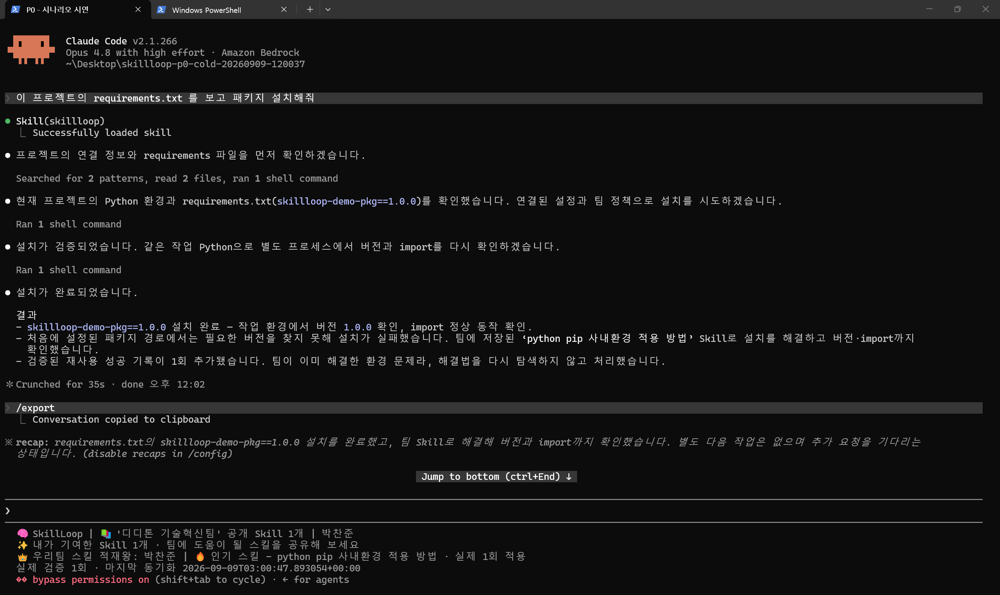

# P0 실제 시연 — Agent SkillLoop

**팀이 이미 해결한 환경 문제라면, 다음 Agent는 해결법을 다시 탐색할 필요가 없습니다.**

[▶ 시연 영상 보기·다운로드 (MP4, 58초)](p0-demo.mp4) · [한국어 자막 (SRT)](p0-demo.ko.srt) · [실제 Claude Code 캡처 원본](p0-claude-code.png)

## 영상에서 보여주는 흐름

자연어로 requirements 설치 요청 → 기존 패키지 경로에서 실제 설치 실패 → 팀에 저장된 Skill 검색 → 사전 승인된 P0 작업 범위에서 적용 → 같은 Python 환경의 설치·버전·import 검증 → 검증된 재사용 성공 1회 기록.

시연은 가상 사내환경의 로컬 패키지 공급 제약과 GitHub 기반 팀 Skill 공유를 사용합니다. 실제 회사의 프록시·보안 제품을 시험한 결과는 아닙니다.

## 파일과 사용 방법

| 파일 | 내용 |
| --- | --- |
| [p0-demo.mp4](p0-demo.mp4) | 사용자가 제공한 편집 영상, 1920×1080, 58초 |
| [p0-demo.ko.srt](p0-demo.ko.srt) | 한국어 자막 11구간, 00:00~00:58 |
| [p0-claude-code.png](p0-claude-code.png) | 자연어 요청·최종 결과·하단 실제 검증 1회가 보이는 사용자 캡처 |
| [manifest.json](manifest.json) | 원본 파일명, 파일 크기, SHA-256, 확인 범위 |

GitHub에서 재생 미리보기가 나오지 않으면 영상 링크의 **View raw / Download**로 내려받아 재생하세요. 플레이어에서 자막을 직접 불러올 때는 `p0-demo.ko.srt`를 선택합니다. 원본 영상과 자막의 내용은 수정하지 않았습니다.

## 실행 증거와 구분

영상의 58초는 **편집 영상 길이**이며 업무 수행 시간이나 전후 성능 비교 수치가 아닙니다. 캡처에 보이는 최종 실제 검증 1회만으로 시작값에서의 숫자 변화 전 구간을 입증하지는 않습니다. 자막의 다중 후보 선택 설명은 제품 규칙 설명이며, 이 시연에서 다중 후보 실험을 새로 수행했다는 뜻은 아닙니다.

[실제 GitHub 수신·자동 적용 검증 로그](../p0-scoped-auto-20260909/github-cold-full.txt) · [검증 결과](../p0-scoped-auto-20260909/github-cold-result.json) · [새 Cold 환경 준비 안내](../../aidlc-docs/construction/build-and-test/org-demo-user-guide.md)

위 자동 검증 로그는 별도 실행의 근거이며 이 영상과 동일한 실행이라고 주장하지 않습니다. 이번 정리는 사용자 제공 미디어의 보관·연결 작업이며 새로운 P0 실행이나 QA 지적 자동 종결은 아닙니다.

루트 `P0캡처.png`는 웹 캡처 탭의 기존 import 경로를 유지하기 위해 보존했습니다. 이 폴더의 PNG와 파일 내용은 같습니다.

## AI 영상 평가 패키지

[평가 패키지 전체 다운로드 (ZIP)](ai-evaluation/p0-ai-evaluation.zip) · [평가 순서](ai-evaluation/README_평가순서.txt) · [평가 가이드](ai-evaluation/Agent_SkillLoop_AI_평가자료.md) · [기계 판독 데이터 (JSON)](ai-evaluation/Agent_SkillLoop_AI_평가데이터.json)

사용자가 추가 제공한 가이드·타임코드·카운트 전후 프레임·별도 실행 참조 자료입니다. GitHub에서 직접 읽을 수 있도록 ZIP 원본과 압축 해제본을 함께 보관했습니다. [카운트 변화 이미지](ai-evaluation/Agent_SkillLoop_카운트변화.png) · [전체 프레임 증거](ai-evaluation/evidence/) · [파일 무결성 확인 기록](ai-evaluation/package-receipt.json).

패키지 내부 설명과 참조 실행의 구분은 원문 그대로 유지했습니다. 이번 업로드에서는 ZIP CRC와 제공된 SHA-256 목록을 대조했으며 별도의 Agent 실행·영상 재측정·QA 판정은 수행하지 않았습니다.
