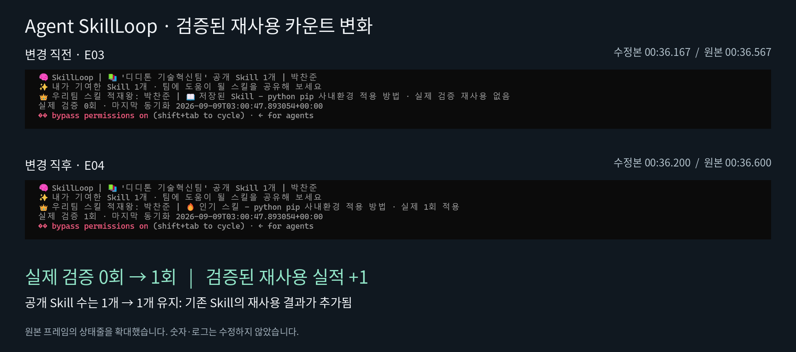

# Agent SkillLoop — AI 평가용 영상·효과 근거

**핵심 관찰: 수정 영상 00:36.200 부근에서 ‘실제 검증 0회 → 1회’로 바뀝니다. 공개 Skill 수는 1개 → 1개로 유지됩니다.**

이 시연은 노웨어(NOWHERE)의 P0 **기존 팀 Skill 재사용**입니다. 사용자는 패키지 설치 업무만 요청합니다. Agent는 현재 경로의 설치 실패 뒤 기존 팀 Skill을 적용해 같은 작업 환경의 설치·버전·import 확인을 마쳤다고 보고합니다. 실제 상태줄의 재사용 실적 +1과 최종 답변의 ‘성공 기록 1회 추가’가 서로 뒷받침됩니다.

## 바로 평가할 수 있는 실제 효과

| 항목 | 전 | 후 / 관찰값 | 의미와 근거 |
|---|---:|---:|---|
| 실제 검증 카운트 | 0회 | **1회 (+1)** | 같은 원본 영상의 상태줄. E03/E04, 수정본 E07/E08 |
| 공개 Skill 수 | 1개 | **1개 (변화 없음)** | 새 공개 Skill 증가와 재사용 실적을 구별. E03/E04 |
| 사용자 업무 요청 | — | **1건** | 패키지 설치만 요청. E01 |
| 사용자의 추가 검색·적용·카운트 지시 | — | **영상에서 0건 관찰** | 원본 녹화 구간 내 추가 입력 없음. 세션 밖 행위는 판단하지 않음 |
| 설치 완료 | 실패가 있었다고 최종 답변에 보고 | 완료 보고 | 원문 오류·성공 stdout는 접혀 있음. E06 |
| 버전·import | 확인 명령 실행 | **버전 1.0.0·import 정상 보고** | 실제 명령 E05, 결과 보고 E06 |
| 재사용 성공 기록 | — | **1회 추가 보고** | E06. 첫 행 카운트와 같은 사건이므로 합산해 2회로 세지 않음 |

## 가장 중요한 카운트 증거

| 증거 | 원본 시각 / 0부터 센 프레임 | 수정본 대응 시각 / 프레임 | 실제 표시 |
|---|---|---|---|
| E03 / E07 | 00:36.567 / 1097 | 00:36.167 / 1085 | 실제 검증 **0회** |
| E04 / E08 | 00:36.600 / 1098 | 00:36.200 / 1086 | 실제 검증 **1회** |

30fps 프레임 단위로 전환을 확인했습니다. 시각은 밀리초 반올림 값입니다. PNG 비교 그림은 위 원본 두 프레임의 상태줄을 확대하고 설명을 바깥에 붙인 자료입니다. 숫자나 로그는 바꾸지 않았습니다. ZIP의 `evidence/`에는 크롭하지 않은 전체 원본 프레임과 수정본 전환 프레임이 있습니다.

상태줄의 Skill 설명도 ‘저장된 Skill … 실제 검증 재사용 없음’에서 ‘인기 스킬 … 실제 1회 적용’으로 바뀝니다. 공개 Skill 수는 계속 1개입니다. 따라서 **기존 Skill의 실제 재사용 실적이 생긴 장면**으로 평가할 수 있습니다. 로컬 사용 기록 JSON 파일을 직접 열어 비교한 자료는 아니므로, 디스크의 영속 데이터나 원격 저장소 갱신까지 화면 숫자 하나로 확정하지는 않습니다.

## 영상 내용과 근거 위치

| 수정본 시간 | 내용 | 근거 종류 |
|---|---|---|
| 00:00–00:08 | 사용자가 ‘이 프로젝트의 requirements.txt 를 보고 패키지 설치해줘’ 입력 | 실제 사용자 입력, E01 |
| 00:08–00:16 | Agent가 프로젝트·Python 환경·requirements 확인 | 실제 화면 |
| 00:16–00:19 | `skillloop apply-requirements` 처리 명령 | 실제 실행 명령, E02 |
| 00:19–00:24 | 가상 사내환경의 패키지 경로 실패를 설명 | 보충 자막. 실패 사실은 최종 답변 E06에 보고됨 |
| 00:24–00:36 | 동기화된 팀 Skill의 조건 비교·선택·적용 방식 설명 | 저장소 코드에 근거한 보충 자막. 내부 로그는 접힌 상태 |
| **약 00:36.200** | **실제 검증 카운트 0 → 1** | 실제 상태줄, E03/E04/E07/E08 |
| 00:36–00:43 | 같은 작업 Python의 별도 프로세스로 버전·import 재확인 | 실제 명령, E05 |
| 00:43–00:47 | 설치·버전·import와 재사용 기록 결과를 보고 | Agent 최종 답변, E06 |
| 00:47–00:53 | 이미 추가된 재사용 1회를 자막으로 설명 | 신규 카운트 증가 장면이 아님 |
| 00:53–00:58 | 같은 환경 문제의 해결 경험을 다음 Agent가 재사용한다는 가치 설명 | 실제 최종 화면 위 편집 자막 |

카운트는 별도 프로세스의 후속 재확인보다 먼저 표시됩니다. 원본에서는 그 전에 ‘설치가 검증되었습니다’라고 안내하고 다시 확인하겠다고 말합니다. 구현은 내부 설치·검증 뒤 기록합니다. 따라서 **후속 재확인 뒤 처음 카운트가 증가했다**고 시간 순서를 바꾸어 설명하면 안 됩니다.

## 왜 단순한 pip 설치 시연 이상의 효과인가

- 사용자는 해결 방법이나 Skill 이름을 지정하지 않고 업무를 요청합니다.
- Agent는 환경 제약을 만났을 때 이미 축적된 팀 절차를 사용했다고 보고합니다. 최종 답변과 상태줄에서 같은 Skill 표시명 ‘python pip 사내환경 적용 방법’을 확인할 수 있습니다.
- 적용 뒤 실제 사용 가능 여부를 확인하는 명령이 실행되고, 그 결과가 최종 답변과 재사용 실적에 남습니다.
- 사용 실적을 ‘Skill을 보유했다’는 사실과 구분합니다. 공개 Skill 1개는 그대로이고 검증된 재사용만 1회 증가합니다.

이 자료로 확인하는 효과는 **기존 경험의 업무 적용, 사용 검증 결과 보고, 재사용 실적 +1**입니다. 재탐색에 쓸 시간을 줄인다는 제품 가치는 설명할 수 있으나, 대조 실행이 없으므로 몇 분·몇 토큰·몇 %를 절감했다고 수치화하지 않습니다.

## 카운트 규칙과 검색 방식 — 구현 근거

검토 커밋: `edcbbf44e7f0985351bd006ee37cfb0054483776`. 촬영된 실행의 정확한 커밋은 영상만으로 확인되지 않습니다.

| 규칙 | 코드에서 확인한 동작 | 출처 |
|---|---|---|
| 실패 신호 생성 | 실제 pip 실패 결과에서 대상 패키지 공급 실패를 식별 | [cli.py](https://github.com/THEGREATCJPark/ddthon/blob/edcbbf44e7f0985351bd006ee37cfb0054483776/skillloop/cli.py) |
| Skill 선택 | 실패 신호와 적용 조건 비교. 정확 일치 2점, 상위 유형 일치 1점. 적합도↓ → 버전↓ → ID↑ | [match.py](https://github.com/THEGREATCJPark/ddthon/blob/edcbbf44e7f0985351bd006ee37cfb0054483776/skillloop/match.py) |
| Skill 가져오기 | GitHub에서 미리 동기화한 로컬 목록의 descriptor·procedure 사용 | [gitsync.py](https://github.com/THEGREATCJPark/ddthon/blob/edcbbf44e7f0985351bd006ee37cfb0054483776/skillloop/gitsync.py) |
| 실제 성공 확인 | pip 종료코드·설치 버전·import 확인 | [reuse_service.py](https://github.com/THEGREATCJPark/ddthon/blob/edcbbf44e7f0985351bd006ee37cfb0054483776/skillloop/reuse_service.py) |
| 정상 재사용 기록 경로 | 실제 성공, demo seed 아님, 미기록 run_id일 때 +1 | [usage.py](https://github.com/THEGREATCJPark/ddthon/blob/edcbbf44e7f0985351bd006ee37cfb0054483776/skillloop/usage.py) |
| 같은 실행 재기록 | 같은 run_id는 `same-execution`, 증가 없음 | [usage.py](https://github.com/THEGREATCJPark/ddthon/blob/edcbbf44e7f0985351bd006ee37cfb0054483776/skillloop/usage.py) |
| Skill 적용 없이 이미 설치 성공 | `INSTALL_OK_NO_REUSE`, 재사용 증가 0 | [cli.py](https://github.com/THEGREATCJPark/ddthon/blob/edcbbf44e7f0985351bd006ee37cfb0054483776/skillloop/cli.py) |
| 같은 공유 이벤트 재수신 | event_id로 중복 집계 방지 | [usage.py](https://github.com/THEGREATCJPark/ddthon/blob/edcbbf44e7f0985351bd006ee37cfb0054483776/skillloop/usage.py) |

설치 명령을 실행하는 SkillLoop 자체의 Python과 `--python`으로 지정한 업무 대상 Python을 구별해야 합니다. E02의 설치 대상과 E05의 별도 검증 대상은 같은 작업 프로젝트의 `.venv`입니다.

## 별도 실행에서 확인된 보강 데이터

저장소의 `scope-proof` 검증은 **이번 녹화와 다른 실행**입니다. 아래 결과를 영상 실행의 성과에 더하지 않습니다. 원문을 ZIP의 `references/`에 수록했습니다.

| 항목 | 별도 검증 결과 |
|---|---|
| 재사용 카운트 | 0 → 1 → 재시도 후 1 유지 |
| 실제 설치·독립 import | 최종 설치 종료코드 0 / 독립 import 종료코드 0 / 버전 1.0.0 |
| MATCH 후보 | 유효 후보 1개, 적합도 1점 |
| 범위 확인 | `SCOPED_TEAM_POLICY` 출력 |
| 성공 기록 | `counted=True` 출력 |
| 팀 Skill 가져오기 | `git_pull_ok=true` |
| 해당 검증의 재사용 이벤트 원격 전송 | `live_events_pushed=false` |

재시도는 이미 설치된 상태여서 `INSTALL_OK_NO_REUSE`로 끝납니다. ‘재시도 후 카운트 유지’의 근거이며, 이 로그만으로 `same-execution` 가드 자체를 호출해 검증했다고 말하지 않습니다. [결과 JSON](https://github.com/THEGREATCJPark/ddthon/blob/edcbbf44e7f0985351bd006ee37cfb0054483776/result/p0-scoped-auto-20260909/github-cold-result.json) · [실행 로그](https://github.com/THEGREATCJPark/ddthon/blob/edcbbf44e7f0985351bd006ee37cfb0054483776/result/p0-scoped-auto-20260909/github-cold-full.txt)

## 평가 시 구분할 사항

- **실제 화면 관찰 / Agent 결과 보고 / 코드 규칙 / 별도 실행 / 편집 자막**을 구별합니다. 특히 자막을 원문 로그로 읽지 않습니다.
- 원본에는 오류 원문, MATCH·후보 비교, 승인 범위 확인, 성공 stdout가 펼쳐져 있지 않습니다. 이 부분은 결과 보고나 구현 근거로 설명했습니다.
- 공개 Skill 수가 1개로 보이는 것과 유효 검색 후보 수를 직접 확인한 것은 다릅니다. 이번 영상의 실제 MATCH 후보 수·내부 ID·digest는 미확인입니다.
- 실제 사내망·프록시 차단, 이번 실행의 GitHub 공유 완료, 다른 PC 재현, P1 새 Skill 생성·사람 검토·Replay·게시를 이 영상의 성과로 주장하지 않습니다.
- 시간·비용·토큰 절감률과 일반화 성공률은 미측정입니다. JSON의 `null`은 0이나 실패가 아니라 근거가 없음을 뜻합니다.

## 파일 식별과 사용 방법

평가에는 **이 문서 + JSON + 카운트 증거 PNG + 수정 영상**을 함께 사용하면 됩니다. ZIP에 수정 영상·SRT·위 파일들과 전체 증거 프레임·별도 검증 원문을 묶었습니다. 원본 51.8초 영상 전체는 중복 용량을 줄이기 위해 ZIP에서 제외했으며 핵심 전체 프레임을 포함했습니다.

- 수정본: `Agent_SkillLoop_P0_58s.mp4`, 58초 / 1920×1080 / 30fps.
- 수정본 SHA-256: `db86ab8a32d2da23142ed4d5ba9344b89c0bdedf7fb635b37d10483a1c9a15e3`
- 원본 SHA-256: `dc6688a9f8d716a6c455fd811d741bd1fc4933727f6a078c97977079d6472603`
- 편집본 길이는 자막을 읽기 위한 정지·배속을 포함하므로 업무 처리 시간이나 시간 절감량으로 사용하지 않습니다.

기계 판독 데이터에는 사건별 증거 종류·시각·프레임·원본 파일 hash·미측정 값과 편집 시간 매핑이 들어 있습니다. 점수나 순위는 미리 정하지 않고 확인 가능한 사실을 제공합니다.
