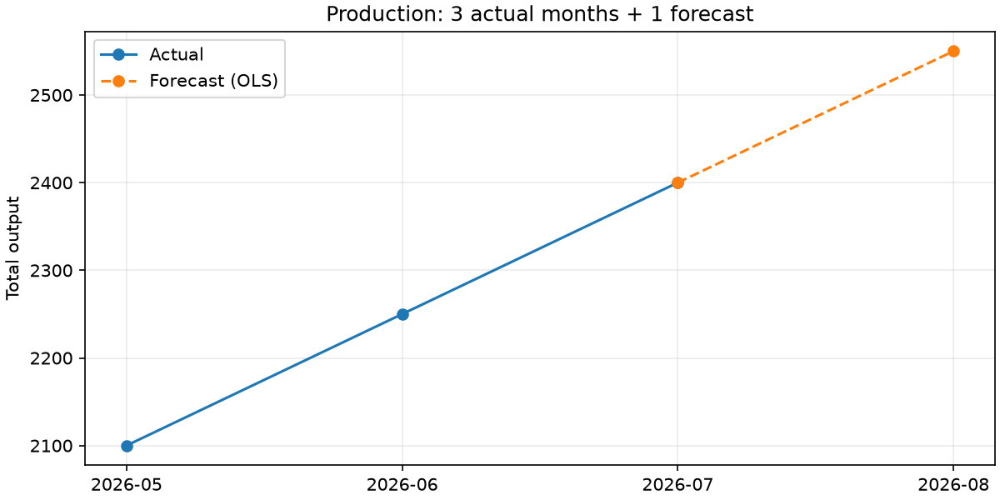
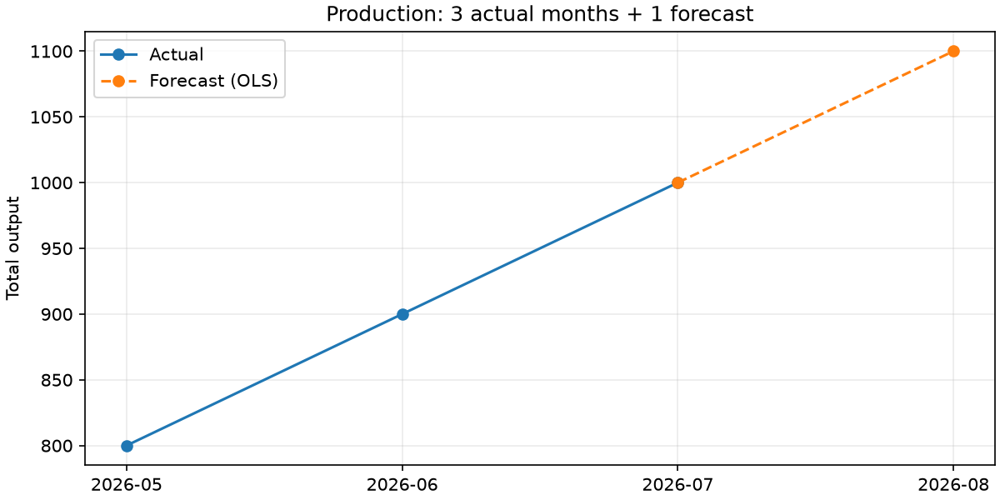
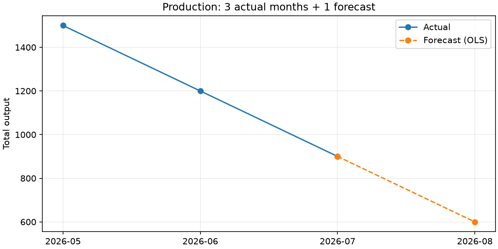
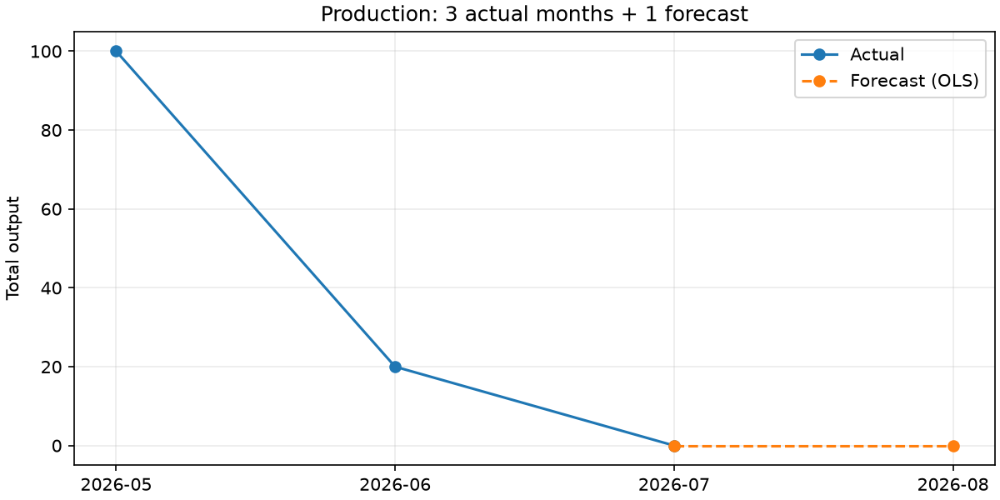

# P1 실제 수용 검증 — 2026-09-08 밤

검증 제품 소스: `96f3c85fe3807f4e8c16d2d09034fa159bdbc40a`. 이번 4개 새 Claude 세션 동안 제품 코드·C9·테스트 소스는 변경하지 않았다. 기존 diagnostic Cold와 별도로, 실제 원격 Warm 1회와 추가 Cold 3회를 실행했다.

| 실행 | 실제 3개월 생산량 | 다음달 예상 | 검색 | 후보 변화 | 재사용 변화 | 판정 |
| --- | --- | --- | --- | --- | --- | --- |
| Warm | 2100 / 2250 / 2400 | 2550 | MATCH | 0 | +1 | PASS |
| Cold 1 | 800 / 900 / 1000 | 1100 | NO_MATCH | +1 | 0 | PASS |
| Cold 2 | 1500 / 1200 / 900 | 600 | NO_MATCH | +1 | 0 | PASS |
| Cold 3 | 100 / 20 / 0 | 0 (OLS -60을 0 처리) | NO_MATCH | +1 | 0 | PASS |

Cold마다 서로 다른 시트·UsedRange 시작 행·열·데이터를 사용했다. 빈 Excel Skill 저장소에서 새 세션이 실제 직접 읽기 실패, 검색, 대안 탐색, 업무 매핑·계산·차트와 후보 생성을 수행했다. 공유 후보는 세 번 모두 같은 `action=file-access, method=excel-com-attach`와 digest였으며, 업무 값·열·시트는 후보에 포함되지 않았다. 원본 SHA256은 모든 실행에서 동일했다.

## 승인·Replay·GitHub 왕복

사용자가 현재 대화에서 exact 후보와 Replay 통과 후 게시·새 Agent 재사용을 명시적으로 승인했다. 이 승인 이전에 승인 기록을 만들지 않았다.

- exact 후보: `file-access-8738e696cff8bbb20c98`, `1.0.0`, `359c5c1763416cdb3aa9828adef40219d1ac5448f82d62f91ebbca82768727af`.
- 실제 사람 승인 기록 → 다른 배치/값 workbook의 독립 Replay PASS → 실제 원격 push 확인 → PUBLISHED.
- Skill 게시 commit: `28809464218e7328c7184a20bcafebb0e1b18916` (`team-skill-store`).
- 새 mirror/store에 pull: imported=1, conflict=0. receiver의 local_review_evidence와 replay는 null 유지.
- 새로운 Claude Warm에서 exact 사용자 실행 승인만 전달했다. 새 로컬 승인/Replay를 만들지 않고 업무를 수행했다.
- 실제 Warm 재사용 이벤트 push commit: `04d831066e0fcdae3217412385e37dc0f08cae58`.
- 원래 환경으로 pull 1회: events=1. 반복 pull: events=0. 누적 조직 이벤트=1 유지.

## 실행 근거

- [판정·검사별 결과](validation.json), [실제 lifecycle](lifecycle.json), [이벤트 왕복](usage-roundtrip.json).
- 각 `*-trace.json`: 실제 Claude 도구 입력/출력과 사용자에게 보인 설명. 비공개 thinking/signature 블록은 제외했다. 원본은 로컬 TEMP에 보존했다.
- 각 `*-product-reports.json`: 실제 도구 출력에서 추출한 제품 결과. 별도 기대값으로 꾸며 생성하지 않았다.
- 각 `*-status.json`: 시작/종료 시간, 원본 해시, 실제 저장소·usage·차트.
- `cold-*-operator-profile.json`: Agent 작업 폴더 밖의 준비 프로필과 검증용 기대값.
- [수신 조직 집계](receiver-org-snapshot.json): published=1, verified_reuse_events=1, local actual=0.
- `scripts/run-p1-acceptance.py`: 이번 승인과 준비된 workspace에 연결한 운영자 실행 기록. 범용 무승인 게시 도구가 아니다.
- `scripts/verify-p1-acceptance.py`: 실제 로그·프로필·저장소를 대조하는 재검사. `python scripts/verify-p1-acceptance.py`로 확인 가능.

## 보존한 한계와 개선점

1. 각 새 세션은 성공했지만 중간 도구 권한 거절·JSON 스키마 재시도가 있었다. 해당 출력은 삭제하지 않았다. `intermediate_error_count`는 로그상 오류 도구 결과 수이며 최종 시나리오 실패 횟수가 아니다. Cold 소요 시간은 약 2분33초 / 2분41초 / 3분8초, Warm은 약 1분22초다. 성능 SLA를 입증한 것은 아니다.
2. Warm Agent의 최종 설명 중 파일 잠금을 직접 실패 원인처럼 표현한 문장은 부정확하다. 실제 조건은 Office 암호화 바이트가 일반 OOXML ZIP 파서로 읽히지 않는 것이다. 잠금 파일은 열린 환경의 단서일 뿐 실패 원인 증명이 아니다. 결과 데이터·차트·실행 성공과 설명 품질을 구분한다.
3. 동일 Windows PC에서 독립 세션/저장소와 실제 GitHub 네트워크를 사용했다. **B PC에서의 재현은 아직 NOT_RUN**이다.
4. 상태줄의 인기·실적은 로컬 기준이며 팀 기여 순위는 집계 대기다. 조직 데이터에는 이벤트 1건이 정상 반영됐다. 화면의 공용 지표 마무리를 완료로 과장하지 않는다.
5. 현재 구현한 공유 수단은 Git이다. S3/DB 어댑터는 미구현 확장안이다. 실제 NASCA 제품에서의 동작을 검증한 것은 아니다.
6. 이 결과는 P1 핵심 lifecycle 완료 근거지만 전체 제출물·최종 Build and Test 승인 완료는 아니다.

## 실제 차트

