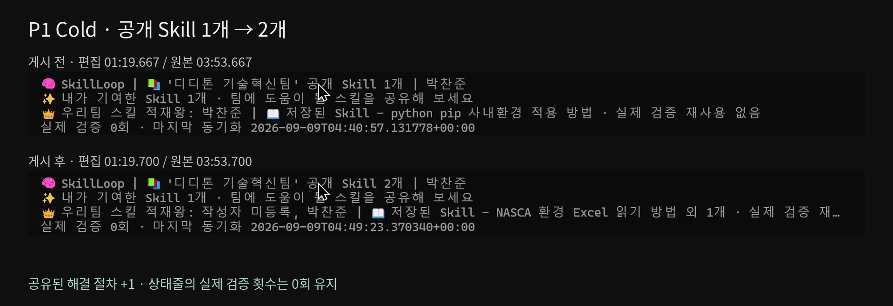

# Agent SkillLoop · P1 Cold 편집표

원본 4분 8.57초를 **90초 / 1920×1080 / 30fps**로 편집했습니다. 업무 요청 → 접근 실패·기존 해결책 없음 → 사용자의 자연스러운 질문 → 열린 문서 탐색·읽기 → 결과 → 사람 승인 → 독립 Replay → 게시 순서를 유지합니다.

화면은 원본 녹화의 확대·크롭만 사용했습니다. 자막은 별도 하단 여백에 배치했습니다. 이름·계정명을 포함한 원본 화면의 글자는 마스킹하지 않았습니다. 원본 오디오는 무음이므로 BGM 없이 출력했습니다.

## 원본 → 편집 대응

| 원본 구간 | 편집 구간 | 장면 | 처리 |
|---|---|---|---|
| 00:00:00.000–00:00:01.400 | 00:00:00.000–00:00:01.400 | 업무 요청 입력 | 정속 |
| 00:00:01.400–00:00:08.000 | 00:00:01.400–00:00:08.000 | 업무 요청 실행 | 정속 |
| 00:00:18.500–00:00:24.500 | 00:00:08.000–00:00:10.000 | 직접 읽기와 팀 Skill 검색 실행 | 3배속 |
| 00:00:24.800–00:00:28.800 | 00:00:10.000–00:00:14.000 | 파일 직접 읽기 실패 보고 | 정속 |
| 00:00:33.600–00:00:37.600 | 00:00:14.000–00:00:18.000 | 기존 해결 방법 없음 보고 | 정속 |
| 00:00:37.600–00:00:44.600 | 00:00:18.000–00:00:25.000 | 사용자의 환경 설명 입력 | 정속 |
| 00:00:48.800–00:00:52.800 | 00:00:25.000–00:00:29.000 | 열린 Excel 조사 시작 | 정속 |
| 00:01:01.000–00:01:10.000 | 00:00:29.000–00:00:32.000 | Excel 인스턴스와 문서 탐색 | 3배속 |
| 00:01:24.000–00:01:28.000 | 00:00:32.000–00:00:36.000 | 정확한 대상 문서 발견 | 정속 |
| 00:01:49.000–00:01:53.000 | 00:00:36.000–00:00:40.000 | 열린 문서에서 데이터 읽기 성공 보고 | 정속 |
| 00:02:27.000–00:02:39.000 | 00:00:40.000–00:00:44.000 | 접근 절차와 업무 매핑 적용 | 3배속 |
| 00:02:42.000–00:02:45.000 | 00:00:44.000–00:00:47.000 | 업무 완료와 차트 파일 읽기 보고 | 정속 |
| 00:02:57.300–00:02:59.300 | 00:00:47.000–00:00:55.000 | 실제 생산량과 예측값 결과 | 정속 + 마지막 실제 프레임 6초 유지(표시 포함) |
| 00:02:59.300–00:03:05.300 | 00:00:55.000–00:01:01.000 | 사람 승인 선택창과 실제 선택 | 정속 |
| 00:03:07.000–00:03:10.000 | 00:01:01.000–00:01:04.000 | 공유 범위와 승인 기록 안내 | 정속 |
| 00:03:22.000–00:03:38.000 | 00:01:04.000–00:01:08.000 | 승인 후 독립 Replay 실행 | 4배속 |
| 00:03:40.000–00:03:46.000 | 00:01:08.000–00:01:14.000 | Replay PASS 및 원본 변경 없음 보고 | 정속 |
| 00:03:46.000–00:03:52.000 | 00:01:14.000–00:01:18.000 | 검증된 후보 게시 실행 | 1.5배속 |
| 00:03:52.000–00:03:56.000 | 00:01:18.000–00:01:22.000 | 공개 Skill 수 1개에서 2개로 갱신 | 정속 |
| 00:04:00.000–00:04:08.000 | 00:01:22.000–00:01:30.000 | 게시 완료·커밋·공유 범위 확인 | 정속 |

중간에 빠진 원본 구간은 대기·반복 설명·화면 전환을 잘라낸 부분입니다. 배속 구간에는 배율을 표시했습니다. **49–55초는 결과를 읽기 위한 화면 유지이며 실제 처리시간이 아닙니다.**

## 화면에서 확인되는 효과

| 항목 | 확인 내용 | 근거 |
|---|---|---|
| 실제 생산량 | 5월 1,200 → 6월 1,350 → 7월 1,500 | 열린 Excel 화면 및 결과 보고 |
| 다음 달 예측 | 8월 1,650. 실제 실적이 아닌 3점 OLS 예측 | 편집 47–55초 |
| 사람 승인 | ‘승인하고 공유’ 선택창과 실제 선택 | 편집 55–61초 |
| 독립 재검증 | Replay PASS, 원본 변경 없음 보고 | 편집 68–74초 |
| 팀 공개 Skill 수 | **1개 → 2개(+1)** | 원본 03:53.700 / 편집 **01:19.700**에 첫 변경 프레임 |
| 게시 완료 | 완료 답변과 커밋 **e302bf2** | 편집 마지막 결과 화면 |
| 검증된 재사용 횟수 | 상태줄 **0회 유지** | 이번 영상은 Cold 해결·게시이며 다음 Agent의 Warm 재사용은 미등장 |

P0에서는 검증된 **재사용 횟수**가 증가했고, 이번 P1에서는 팀에 공개된 **Skill 수**가 증가합니다. 두 지표를 같은 카운트로 합산하지 않습니다. 게시 후 답변과 상태줄의 +1은 같은 게시 사건입니다.

## 근거의 범위

업무 입력·Excel 값·승인 선택·상태줄 숫자는 직접 보이는 화면 근거입니다. 직접 읽기 실패, 관련 Skill 없음, 읽기 성공, Replay PASS, 게시 완료와 커밋은 화면에 표시된 Agent의 실행 결과 보고입니다. 접힌 stdout이나 원격 Git 로그를 별도로 검증한 것으로 표현하지 않았습니다.

후보에 공유하는 내용은 환경 접근 절차입니다. 업무 값·시트·차트·암호가 포함되지 않는다는 실행 보고를 보존했습니다. 원본 화면에 NASCA라는 이름이 있어도 실제 NASCA 제품을 검증했다는 뜻으로 사용하지 않습니다. 가상 사내환경 시연 표기를 유지했습니다.

## 추가 촬영으로 보완할 장면

- **생성된 차트 이미지:** 같은 실행에서 생성한 추세선 PNG를 실제로 열어 5초 촬영해 주세요. 현재 원본에는 파일 읽기 동작·생성 완료 보고·파일 경로만 보여, 차트 그림을 새로 만들거나 합성하지 않았습니다.
- **오류·NO_MATCH 원문:** 같은 실행의 접힌 명령 결과를 펼쳐 Python 직접 읽기 오류와 NO_MATCH를 3–5초 보여주면 좋습니다. 현재는 “일반 Python 파일 읽기로는 읽을 수 없음 / 관련 Skill을 찾지 못함”이라는 Agent의 실제 보고를 사용했습니다.

## 평가용 파일

`Agent_SkillLoop_P1_평가데이터.json`에 원본/편집 타임코드, 실제 값과 예측값, 승인·Replay·게시의 근거 종류, 카운트 전후 값, 증거 화면을 연결했습니다. ZIP의 `evidence/`는 마스킹하지 않은 원본 전체 프레임입니다. `Agent_SkillLoop_P1_게시전후.png`는 같은 원본의 상태줄을 잘라 나란히 설명한 문서용 이미지이며, 영상에 별도 합성 화면으로 넣지 않았습니다.

편집 영상의 90초를 실제 업무 처리시간으로 해석하거나 시간 절감률을 계산하지 않습니다. Warm 재사용 성공은 이번 영상으로 입증하지 않습니다.
